# Entre Mundos 

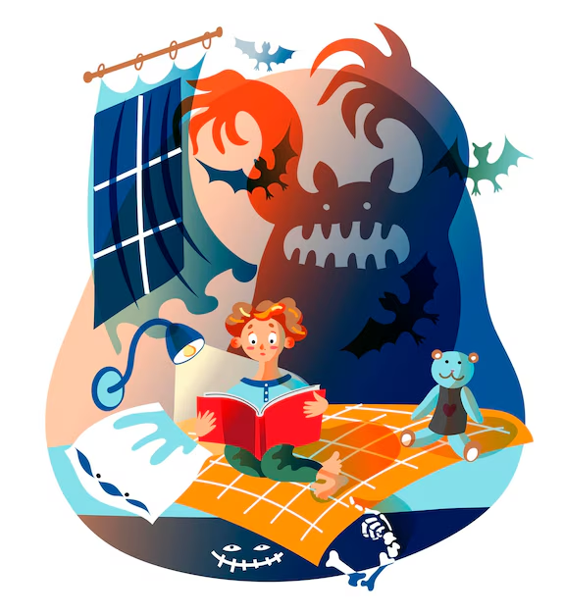

**Equipo de desarrollo:**

Diego García Alonso

Alejandro García Díaz

Valeria Espada Álvarez

Sergio Valiente Urueña

**ÍNDICE**

[**1 Cartas usadas**](#1-cartas-usadas)

[1.1 Cartas del equipo](#11-cartas-del-equipo)  
[1.2 Cartas extra](#12-cartas-extra)

[**2 Resumen**](#2-resumen)

[2.1 Descripción](#21-descripción)  
[2.2 Género](#22-género)  
[2.3 Setting](#23-setting)  
[2.4 Características principales](#24-características-principales)

[**3 Gameplay**](#3-gameplay)

[3.1 Objetivo del juego](#31-objetivo-del-juego)  
[3.2 Core loops](#32-core-loops)

[**4 Mecánicas**](#4-mecánicas)

[4.1 Combate](#41-combate)  
[4.1.1 Reglas](#411-reglas)  
[4.1.2 Recompensas](#412-recompensas)

[4.2 Equipo](#42-equipo)  
[4.2.1 Adquisición de personajes](#421-adquisición-de-personajes)  
[4.2.2 Formación de equipo](#422-formación-de-equipo)

[4.3 Tienda](#43-tienda)  
[4.3.1 Objetos de curación para usar en combate](#431-objetos-de-curación-para-usar-en-combate)  
[4.3.1.1 Poción pequeña](#4311-poción-pequeña)  
[4.3.1.2 Poción grande](#4312-poción-grande)

[4.3.2 Objetos de daño para usar en combate](#432-objetos-de-daño-para-usar-en-combate)  
[4.3.2.1 Bomba pequeña](#4321-bomba-pequeña)  
[4.3.2.2 Bomba grande](#4322-bomba-grande)

[4.3.3 Objetos de utilidad para usar en combate](#433-objetos-de-utilidad-para-usar-en-combate)  
[4.3.3.1 Reloj de arena](#4331-reloj-de-arena)

[4.3.4 Mejoras de los personajes](#434-mejoras-de-los-personajes)

[**5 Interfaz**](#5-interfaz)

[5.1 Controles](#51-controles)  
[5.2 Cámara](#52-cámara)  
[5.2.1 Pantalla de combate](#521-pantalla-de-combate)  
[5.3 HUD](#53-hud)  
[5.3.1 Menú de niveles](#531-menú-de-niveles)  
[5.3.2 Pantalla de tienda](#532-pantalla-de-tienda)

[**6 Mundo del juego**](#6-mundo-del-juego)

[6.1 Personajes](#61-personajes)  
[6.1.1 Timmy](#611-timmy)  
[6.1.2 Personajes comunes](#612-personajes-comunes)  
[6.1.2.1 Goblin saqueador (Fantasía)](#6121-goblin-saqueador-fantasia)  
[6.1.2.2 Espectro arcano (Fantasía)](#6122-espectro-arcano-fantasia)  
[6.1.2.3 Amantes (Romance)](#6123-amantes-romance)  
[6.1.2.4 Corazón roto (Romance)](#6124-corazón-roto-romance)  
[6.1.2.5 Faraón (Historia)](#6125-faraon-historia)  
[6.1.2.6 Escarabajo (Historia)](#6126-escarabajo-historia)  
[6.1.2.7 Bufón (Comedia)](#6127-bufon-comedia)  
[6.1.2.8 Comediante frustrado (Comedia)](#6128-comediante-frustrado-comedia)

[6.1.3 Mini-bosses](#613-mini-bosses)  
[6.1.3.1 Dragón joven (Fantasía)](#6131-dragon-joven-fantasia)  
[6.1.3.2 Cupido (Romance)](#6132-cupido-romance)  
[6.1.3.3 Esfinge (Historia)](#6133-esfinge-historia)  
[6.1.3.4 El Payaso del Caos (Comedia)](#6134-el-payaso-del-caos-comedia)

[6.1.4 Final boss](#614-final-boss)  
[6.1.4.1 Ira](#6141-ira)  
[6.1.4.2 Miedo](#6142-miedo)  
[6.1.4.3 Tristeza](#6143-tristeza)

[6.2 Niveles](#62-niveles)  
[6.2.1 Fantasía](#621-fantasia)  
[6.2.2 Romance](#622-romance)  
[6.2.3 Historia](#623-historia)  
[6.2.4 Comedia](#624-comedia)  
[6.2.5 Terror](#625-terror)

[**7 Experiencia de juego**](#7-experiencia-de-juego)

[**8 Estética y contenido**](#8-estetica-y-contenido)

[**9 Referencias**](#9-referencias)

[9.1 Juegos de referencia](#91-juegos-de-referencia)

# 1 Cartas usadas

## 1.1 Cartas del equipo

Estas son las cartas que hemos decidido usar:

- Miedo **(P12)**  
- Ira **(P11)**  
- Animal Crossing **(M04)**  
- Fire Emblem **(M01)7**  
- En Blanco **(A08)**

## 1.2 Cartas extra 

    Otro equipo nos ha otorgado el efecto de la siguiente carta:

- Tristeza **(P10)**

# 2 Resumen

## 2.1 Descripción

En Entre Mundos los jugadores acompañan a Timmy a través de cinco libros, cada uno con un género (Fantasía, Historia, Comedia, Terror) y un último libro THE END. En cada uno de ellos encontrará combates por turnos al estilo clásico enfrentando diferentes mecánicas y personajes (incluyendo un mini-jefe con alguna habilidad especial) que posteriormente podrán unirse a su equipo y utilizando un sistema de formación de equipo separado en vanguardia y retaguardia. La historia culmina con un jefe final triple que encarna a la Ira, la Tristeza y el Miedo, donde ponen a prueba todo lo aprendido por el camino.

## 2.2 Género

Combate por turnos, fantasía, roguelike.

## 2.3 Setting

Timmy, un niño apasionado por la lectura, se ve arrastrado a una peligrosa aventura tras el secuestro de su gato. Para encontrarlo debe adentrarse en diferentes libros para enfrentar enemigos y encontrar aliados que le ayudarán en su búsqueda.

## 2.4 Características principales

- **Jugabilidad**: El jugador irá entrando por los libros en orden y pasando por combates hasta llegar al jefe del libro y pasar al siguiente libro hasta terminar los 5 y recuperar a su gato. Al principio de cada combate, el jugador podrá seleccionar los personajes desea usar de los que tiene desbloqueados y dónde ubicarlos. Tras terminar cada libro el jugador podrá acceder a una tienda cuyos objetos cambian tras cada partida aportando ese elemento de roguelike y rejugabilidad.  
    
- **Combate**: El área de combate se divide entre la zona enemiga y la zona aliada, ambas con 3 huecos de vanguardia y 3 de retaguardia. Los equipos se turnan para atacar. Dentro de cada equipo, se va atacando por filas, empezando el personaje de arriba a la izquierda y acabando por el de abajo a la derecha. Cada personaje contará con un ataque básico, y en el caso de los mini-bosses un ataque especial disponible cada cierto números de turnos. Además, dentro del turno de cada personaje, el jugador puede elegir uttilizar un item de los que tenga disponibles en el inventario.

# 3 Gameplay

## 3.1 Objetivo del juego

- **Corto plazo**: Ganar el combate del libro en el que se encuentra el jugador. Si es derrotado (todas sus unidades mueren), pierde la partida. Si por el contrario el jugador derrota a los enemigos, gana el combate y pasa al siguiente combate, al boss del libro o en caso de haberlo terminado, pasa al siguiente libro.  
    
- **Largo plazo**: Completar los 5 libros. Construir y mejorar el equipo, superar todos los combates y libros y completar la historia (liberar al gato de Timmy).

## 3.2 Core loops

**Lucha:** Enfrenta enemigos básicos y mini-jefes en combates por turnos, aprovechando la formación de vanguardia y retaguardia y las habilidades de los aliados para superar cada desafío.

**Mejora tu equipo:** Tras cada combate, obtén recompensas que permiten fortalecer a tus personajes y comprar objetos y nuevos personajes en la tienda.

**Descubre nuevos libros:** Avanza en la historia atravesando cinco libros, cada uno con su propio género, estilo y mecánicas únicas que renuevan la experiencia.

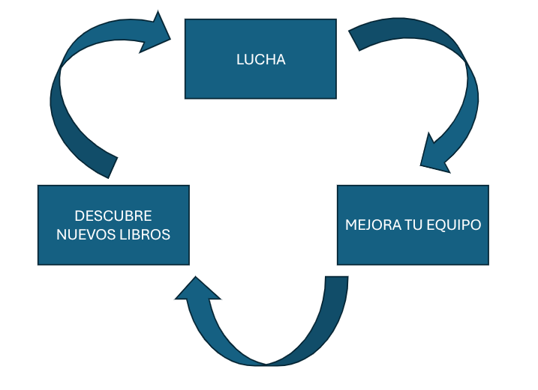

# 4 Mecánicas

   ## 4.1 Combate

### 4.1.1 Reglas

Descripción:

- Combate por turnos entre el equipo aliado y el enemigo (empezando siempre el aliado).  
- **Turno jugador:** 

  \- Personaje A1 \- El jugador escoge entre ataque básico, habilidad (si la tiene) o usar objetos y si escoge una opción que lo requiera, el enemigo o aliado al que va dirigido.

  \- Personaje A2 \- El jugador escoge entre ataque básico, habilidad (si la tiene) o usar objetos y si escoge una opción que lo requiera, el enemigo o aliado al que va dirigido.

  \* Nota: El personaje A3 siempre es Timmy.

  \- Continúa sucesivamente de la misma forma hasta completar sus seis personajes siguiendo el orden que muestra la imagen.

                    \-     **Turno enemigo:** Funciona de la misma manera que el del jugador con el orden de la imagen. Los enemigos no utilizan objetos, solo ataques básicos y habilidades los que las tienen.

                    \-     Se alternan hasta que uno de los dos equipos quede sin personajes con vida.

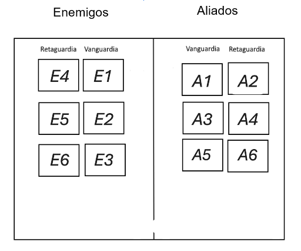

### 4.1.2 Recompensas

Después de cada combate victorioso el jugador será recompensado con una cantidad de oro aleatoria que puede gastar en la tienda.

## 4.2 Equipo

### 4.2.1 Adquisición de personajes

Al principio de la partida el jugador tiene a Timmy. Además, si entra en la tienda podrá comprar al mago, un aliado extra que no requiere haber superado ningún combate para estar disponible. Durante el resto de la partida, el jugador puede comprar personajes pertenecientes a los libros que ya ha completado en la sección de personajes de la tienda, que van cambiando de forma aleatoria a lo largo del juego según los personajes que ya se hayan desbloqueado. Los personajes adquiridos se mantienen durante toda la partida. Si son derrotados en combate no se podrán volver a utilizar hasta el siguiente combate.

### 4.2.2 Formación de equipo

Antes de comenzar un combate, el jugador tiene un tiempo para organizar a su equipo. Dentro de los seis espacios disponibles en el campo de batalla podrá posicionar hasta cinco personajes (porque el sexto siempre es Timmy) que haya comprado en el orden que prefiera para formar el equipo. La posición A3 (Vanguardia 2) es fija, en ella siempre está Timmy, no se puede cambiar.

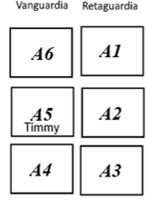

## 4.3 Tienda

El jugador podrá acceder a la tienda desde el menú. No es accesible mientras esté dentro de un libro. En ella podrá comprar diferentes objetos, y personajes con las monedas que haya obtenido a lo largo de la partida.

### 4.2.1 Objetos de curación para usar en combate

#### 4.2.1.1 Poción pequeña

**Precio:** 50 monedas  
**Curación:** 100 HP

#### 4.2.1.2 Poción grande

**Precio:** 150 monedas  
**Curación:** 300 HP

### 4.2.2 Objetos de daño para usar en combate

#### 4.2.2.1 Bomba pequeña

**Precio:** 80 monedas  
**Daño:** 120 a un enemigo

#### 4.2.2.2 Bomba grande

**Precio:** 200 monedas  
**Daño:** 200 de daño a todos los enemigos

### 4.2.3 Objetos de utilidad para usar en combate

#### 4.2.3.1 Reloj de arena

**Precio:** 150 monedas  
**Efecto:** Retrasa la acción de un enemigo 2 turnos

# 5 Interfaz

## 5.1 Controles

El juego se controlará por menús y botones, por lo que principalmente las flechas del teclado para navegar por ellos.

Intro:
- Espacio para continuar.
- Enter para omitir.

Menú principal:
- Flechas derecha e izquierda para moverse por los libros.
- Escacio para entrar al nivel/tienda.

Menú de selección de personajes:
- Flechas para navegar por las opciones y entre menús.
- Escacio para seleccionar héroe/posición.
- Enter para empezar la batalla.
- Esc para volver al menú principal.

Menú de batalla:
- Flechas para navegar por las opciones de un mismo menú.
- B para volver del menú de enemigos al de acciones.
- Espacio para seleccionar acción/enemigo/item.

Tienda:
- Flechas para navegar por las opciones.
- Espacio para comprar.
- Esc para volver al menú principal.

## 5.2 Cámara

### 5.2.1 Pantalla de combate

En el centro de la pantalla se encuentra el escenario de combate, a la derecha el protagonista y sus aliados y a la izquierda los enemigos. Además, la escena incluye un fondo con la ambientación del libro y un menú en la parte inferior que contiene todas las habilidades que pueda usar en combate, incluyendo los objetos comprados en la tienda.

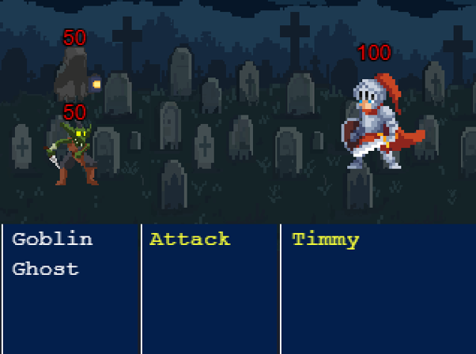

## 5.3 HUD

## 5.3.1 Menú de niveles

El menú de niveles consiste en una estantería en la que cada libro representa un nivel al que el jugador puede acceder. También incluye un libro de acceso a la tienda.

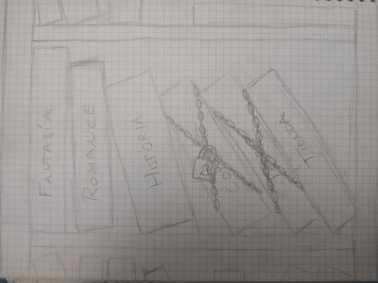

### 5.3.2 Pantalla de tienda

A la izquierda hay un menú con todos los objetos disponibles para comprar y a la derecha una pantalla en la que se especifica la utilidad del objeto seleccionado.  
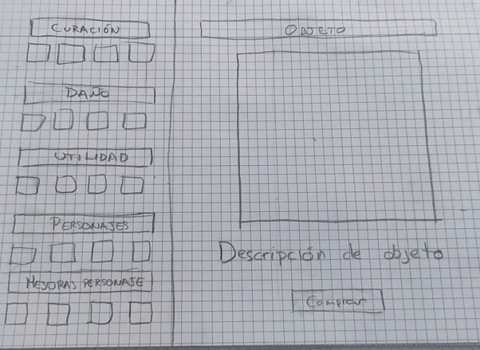

# 6 Mundo del juego

   ## 6.1 Personajes

### 6.1.1 Timmy

**HP base:** 200  
**Ataque base:** 15  
**Defensa base:** 5

### 6.1.2 Personajes comunes

Los personajes comunes tendrán todos el mismo comportamiento, solo cambiando sus estadísticas. Dispondrán de un **ataque básico** que hará un daño del **100%** de su ataque.

#### 6.1.2.1 Goblin saqueador (Fantasía)

    **HP:** 40  
    **Ataque:** 8  

#### 6.1.2.2 Espectro arcano (Fantasía)

    **HP:** 45  
    **Ataque:** 10

#### 6.1.2.3 Ojo volador (Terror)

    **HP:** 45  
    **Ataque:** 10

#### 6.1.2.4 Seta (Terror)

    **HP:** 45  
    **Ataque:** 10

#### 6.1.2.5  Faraón (Historia)

    **HP:** 60  
    **Ataque:** 10

#### 6.1.2.6 Escarabajo (Historia)

    **HP:** 65  
    **Ataque:** 11

#### 6.1.2.7 Bufón (Comedia)

    **HP:** 70  
    **Ataque:** 15

### 6.1.3 Mini \- bosses

Cada libro tendrá un mini-boss al final, a excepción del último que simplemente tendrá el combate del final boss.  
Cada mini-boss aparte del comportamiento de los personajes comunes, tendrá una mecánica propia, su habilidad.

#### 6.1.3.1 Dragon (Fantasía)

    **HP:** 300  
    **Ataque:** 15  

    **Habilidad:** Cada 3 turnos, inflige daño de área a todos los personajes del jugador.

#### 6.1.3.3 Cacodaemon (Terror)

    **HP:** 500  
    **Ataque:** 20
      
    **Habilidad:** Cada tres turnos stunnea inflinge daño cinco vaces a cinco enemigos aleatorios (puede tocra el mismo enemigo varias veces).

#### 6.1.3.3 Medusa (Historia)

    **HP:** 500  
    **Ataque:** 20
      
    **Habilidad:** Cada tres turnos stunnea a todos los personajes del equipo rival durante su siguiente turno.

#### 6.1.3.4 Rey (Comedia)

    **HP:** 1000  
    **Ataque:** 35  
    
    **Mecánica propia:** Invoca tres bufones. Cuando está en el equipo aliado invoca tantos bufones como posiciones vacías haya.

### 6.1.4 Final boss

    El final boss serán en realidad tres personajes: Ira, Tristeza y Miedo. 

#### 6.1.4.1 Ira

    **Vida:** 7000 HP  
    **Ataque:** 170 ATQ  
    **Defensa:** 60 DEF

    **Sed de Sangre (pasiva):** Si elimina a un personaje, se cura una parte de su vida.  
**Berserk:** Aumenta su ataque este turno, pero también pierde algo de vida.  
**Rabia incontenible:** Ataca múltiples veces a un enemigo aleatorio, cambiando el objetivo en cada arremetida.  
**Carga Descontrolada**: Un ataque de área que golpea a todos los enemigos.

Parámetros:

\-Vida que se cura con *sed de sangre* (10% HP)

\- Porcentaje de ataque que gana con *berserk* (+25% ATQ)

\- Porcentaje de vida que pierde con *berserk* (-5% HP)

\- Daño de *rabia incontenible* (50% ATQ x 4\)

\- Daño *carga descontrolada* (150% ATQ)

#### 6.1.4.2 Miedo

**Vida:** 6000 HP  
    **Ataque:** \-  
    **Defensa:** 100 DEF

**Instinto de Supervivencia (pasiva):** Si ira muere primero, miedo entra en un estado de desesperación,  obteniendo un nuevo ataque físico: **Desesperación:** Ejecuta de un golpe el personaje al que ataca.  
    **Ocultarse:** Se vuelve intangible, evitando todo el daño. (no puede usarlo 2 turnos seguidos).  
    **Parálisis por Terror**: Hace que un enemigo pierda su turno.  
**Sombra Aplastante**: Baja las estadísticas de ataque y defensa del equipo enemigo durante unos turnos.

Parámetros:  
\-Cantidad de estadísticas que baja con *sombra aplastante* (-20% ATQ y \-20% DEF durante 2 t	urnos)

#### 6.1.4.3 Tristeza

**Vida:** 5000 HP  
    **Ataque:** \-  
    **Defensa:** 80 DEF  
**Lágrimas contagiosas:** Las lágrimas de tristeza debilitan a un enemigo reduciendo su daño durante un tiempo.

## 6.2 Niveles

Cada uno de los cinco libros corresponde a un género literario —Fantasía, Romance, Historia, Comedia y Terror— y se convierte en un nivel único que Timmy deberá superar. Cada uno estará ambientado en su género.

### 6.2.1 Fantasía

\-2 Goblins saqueadores  
\-2 Espectros arcanos

**Mini-boss:** Dragón

### 6.2.1 Terror

\-2 Ojos voladores  
\-2 Setas

**Mini-boss:** Cacodaemon

### 6.2.3 Historia

\-3 Faraón  
\-2 Escarabajo

**Mini-boss:** Medusa

### 6.2.4 Comedia

\-3 Bufones

**Mini-boss:** Rey

### 6.2.5 The end

Este es el último nivel. El jugador se enfrentará a un triple final boss: Tristeza, Ira y Miedo.

# 7 Minijuegos

Cuando salta crítico (probabilidad de 20%) aparece un evento de minijuego, en el que en función de cómo lo hagas hace más o menos daño. Cada libro tiene su propio minijuego, menos el último libro *"THE END"*.

En este último salta un minijuego aleatorio de los 4 anteriores.  
Cada minijuego puede tener 3 resultados: **perfecto**, **normal**, y **fallido**.

## 7.1 Fantasía
En este minijuego hay que arrastrar el orbe pequeño hasta el área de destino en el tiempo especificado.  
Si el orbe entra perfecto, será resultado perfecto; si entra a medias, normal; y si no entra, fallido.

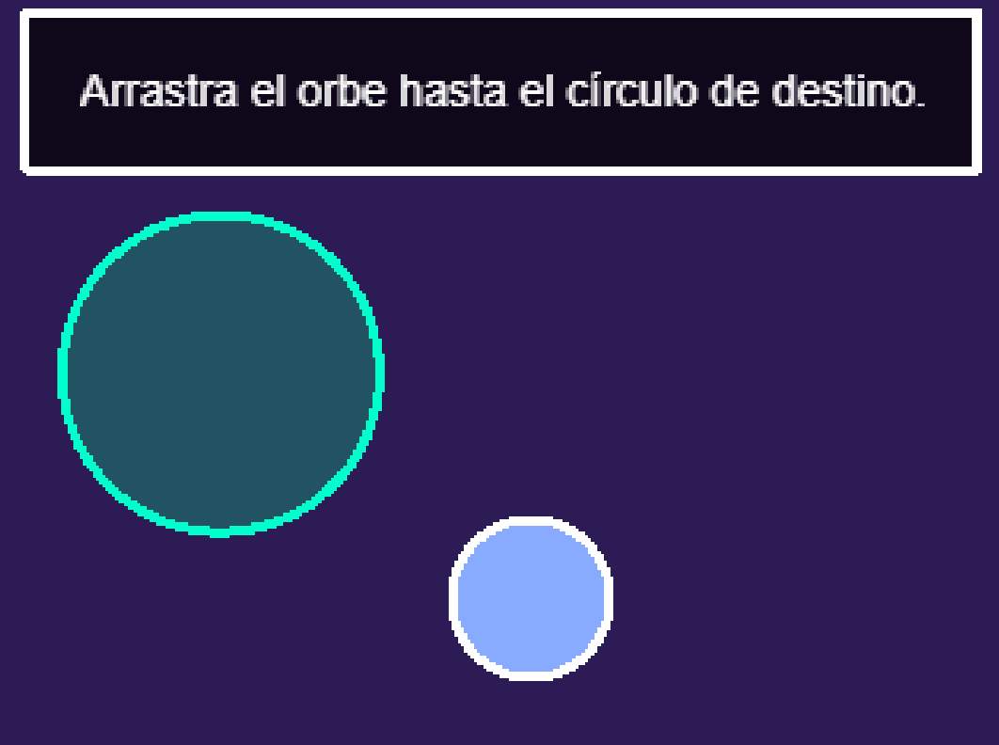

## 7.2 Terror
Hay un cursor que se mueve con vaivén de izquierda a derecha sobre una barra con varias zonas de colores.  
El jugador deberá parar el cursor presionando **espacio**.

- Si acaba en rojo → **perfecto**  
- Si acaba en amarillo → **normal**  
- Si no se presiona a tiempo o acaba en negro → **fallido**

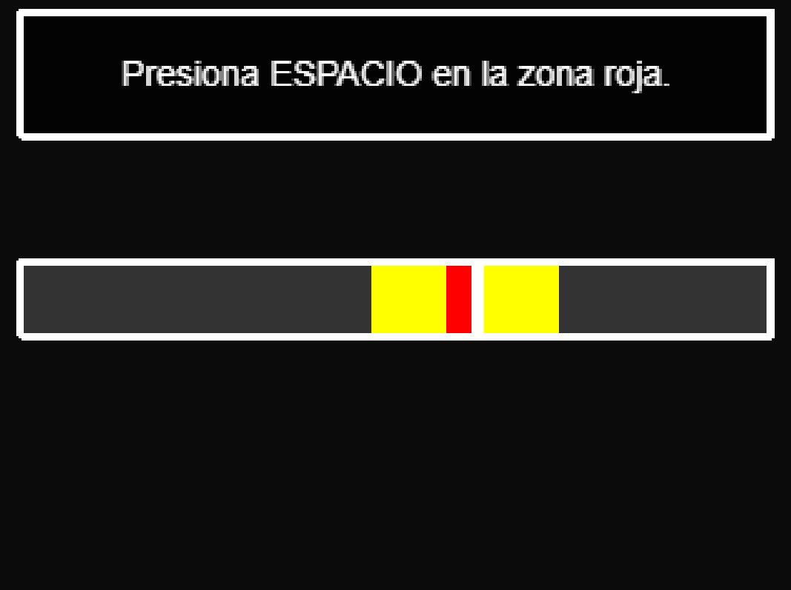

## 7.3 Historia
En el centro de la pantalla aparecerá un objeto.  
A continuación caerán, por efecto de gravedad, 2 objetos diferentes, y el jugador deberá seleccionar el del centro.

- Si acierta → **perfecto**  
- Si falla → **fallido**

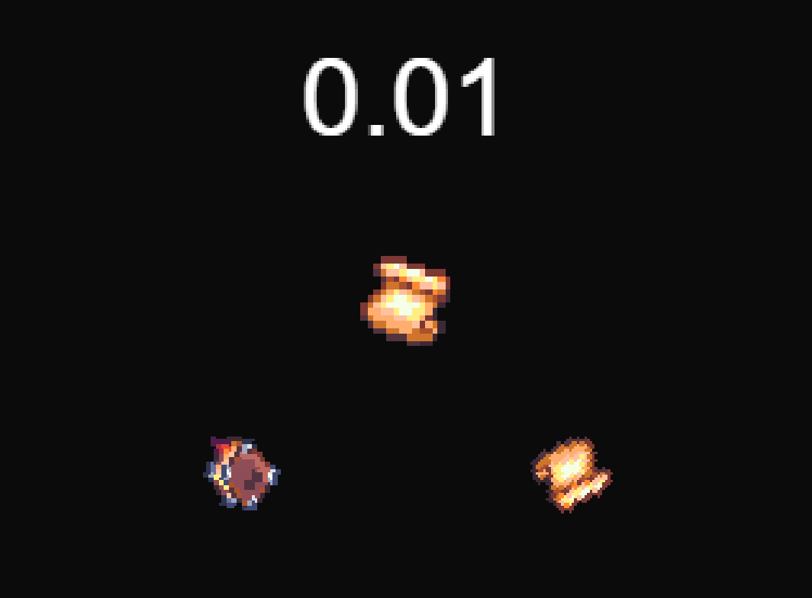

## 7.4 Comedia
En este minijuego aparecerá un payaso en uno de los 6 agujeros.  
El jugador deberá seleccionarlo a tiempo.

- Si acierta → **perfecto**  
- Si falla → **fallido**

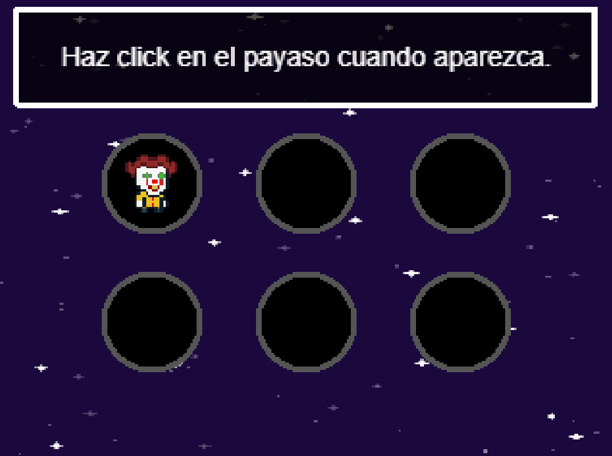

# 8 Experiencia de juego

Una partida comienza cuando el jugador selecciona un libro. Al hacerlo, Timmy y su equipo entran directamente en un combate por turnos contra enemigos temáticos del género de ese libro.

La pantalla de batalla se divide en **dos zonas**: el área aliada y el área enemiga, cada una con **seis casillas** (tres en vanguardia y tres en retaguardia). La disposición es clave: los personajes en vanguardia reciben más daño pero pueden proteger a los de retaguardia, mientras que estos últimos suelen ser más frágiles pero cuentan con ataques de apoyo o a distancia.

En cada turno, el jugador decide la acción de sus personajes:

* **Ataque básico**: siempre disponible.

* **Habilidad especial**: solo los minibosses y cada ciertos turnos.

* **Uso de objetos**: desde pociones curativas hasta bombas ofensivas o herramientas de utilidad, disponible siempre que haya en el inventario.

Al finalizar un combate victorioso, el jugador obtiene **oro**, que le servirá para prepararse de cara al siguiente enfrentamiento.

Tras completar un libro Timmy accede a la **tienda** donde podrá gastar sus monedas en objetos y personajes nuevos. Los artículos disponibles cambian en cada partida, aportando el componente roguelike.

El progreso continúa libro tras libro, con cada uno introduciendo un **mini-jefe** que exige nuevas estrategias. Finalmente, el jugador se enfrentará a un combate decisivo contra un jefe triple que encarna a la **Ira, la Tristeza y el Miedo**, poniendo a prueba todo lo aprendido en los niveles anteriores.

# 9 Estética y contenido

La estética del juego será **pixel art**. 

# 10 Referencias

   ## 10.1 Juegos de referencia

Uno de los referentes principales es **Final Fantasy** en sus entregas clásicas, especialmente las que utilizaban la formación de vanguardia y retaguardia. De este título hemos tomado la idea de que la posición dentro del grupo no es meramente estética, sino un factor estratégico: los personajes en primera línea infligen más daño pero están más expuestos, mientras que los de la retaguardia sacrifican fuerza ofensiva a cambio de mayor protección. Esta dualidad añade una capa táctica a cada combate y obliga al jugador a pensar en cómo organizar a sus héroes antes de cada enfrentamiento.

Otro título que nos ha inspirado es **Octopath Traveler**, por la riqueza de su sistema de combate por turnos y la manera en que cada personaje tiene un rol claramente diferenciado. Nos interesa especialmente la forma en que este juego consigue que cada batalla se sienta única, obligando a experimentar con habilidades, debilidades enemigas y sinergias dentro del grupo. De aquí hemos tomado la idea de que cada encuentro y cada mini-jefe debe proponer un reto distinto, más allá de simples variaciones en la dificultad.

También hemos usado como base algunas partes de: **The Binding of Isaac Rebirth**, en cosas como el sistema de avance de mundos/niveles o la tienda, y su factor de aleatoriedad clásico de un roguelike

