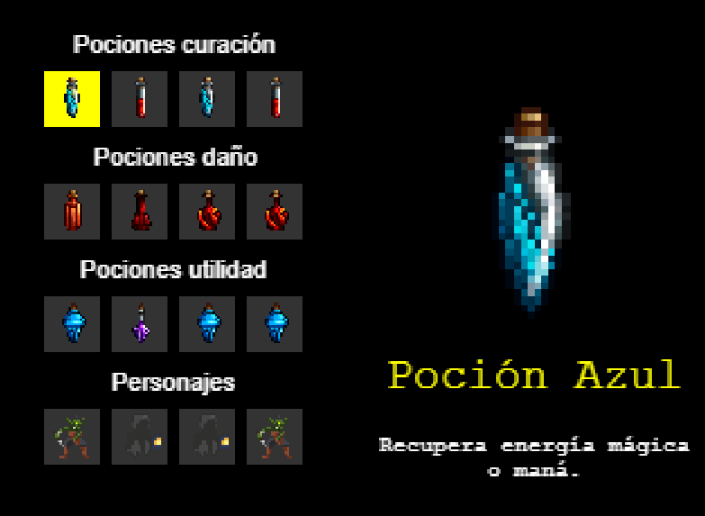
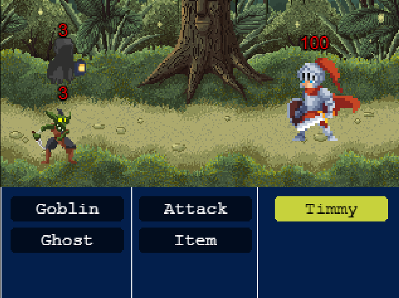
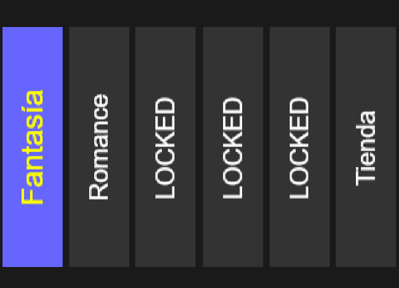

# 📘 ENTRE MUNDOS

### Proyecto universitario
Este proyecto ha sido desarrollado como parte de un **trabajo universitario de desarrollo de videojuegos**.

---

## Descripción general
En **Entre Mundos**, los jugadores acompañan a **Timmy** a través de cinco libros, cada uno con un género distinto: **Fantasía**, **Romance**, **Historia**, **Comedia** y **Terror**.  

En cada uno de ellos encontrará **combates por turnos al estilo clásico**, enfrentando diferentes mecánicas y personajes (incluyendo un **mini-jefe**) que posteriormente podrán unirse a su equipo.  
El sistema de combate se basa en una **formación dividida entre vanguardia y retaguardia**, lo que añade una capa estratégica adicional.  

La historia culmina con un **jefe final triple** que encarna a **la Ira, la Tristeza y el Miedo**, donde se ponen a prueba todas las habilidades aprendidas durante la aventura.

---
## Imágenes del juego

---

## Página con el juego
👉 [Jugar Entre Mundos](https://tekiovu.github.io/Entre-Mundos---Grupo-10/)

---

## Redes sociales
- **Instagram:** [@pandagames1982](https://instagram.com/pandagames1982)  
- **Twitter:** [@pandagames1982](https://twitter.com/pandagames1982)
